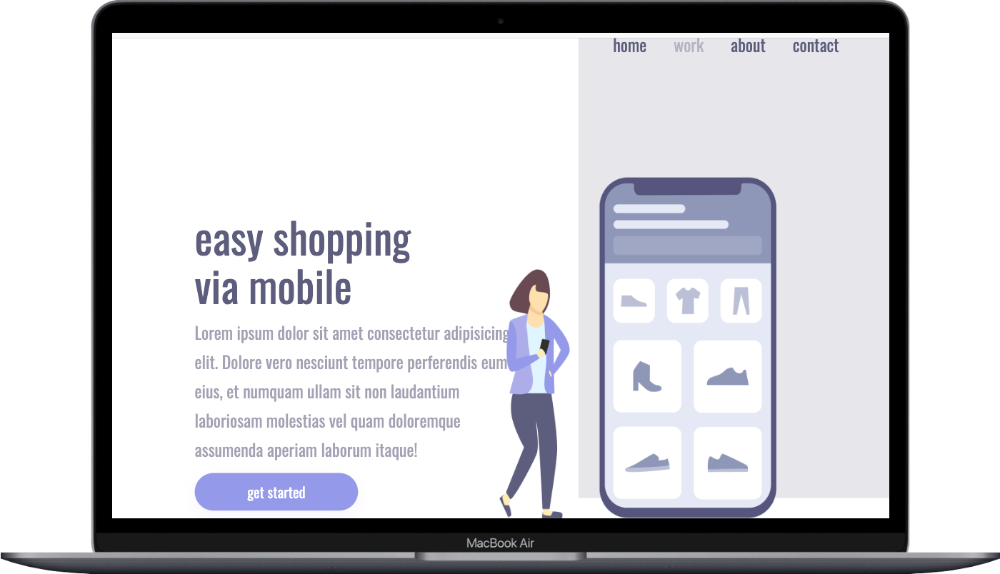

# Easy shoppping
projeto para estudo sobre responsividade.

# Adaptação das telas. 

    
    

### Tecnologias utilizadas

O projeto foi feito com essas 3 tecnologias.

- [x] Html
- [x] Css
- [x] ScrollTrigger

##  desenvolvedor

<table>
  <tr>
    <td align="center">
      <a href="https://www.linkedin.com/in/stanley-rodrigues/">
         
        
          <b>Stanley Rodrigues</b>
        
      </a>
    </td>
  </tr>
</table>

